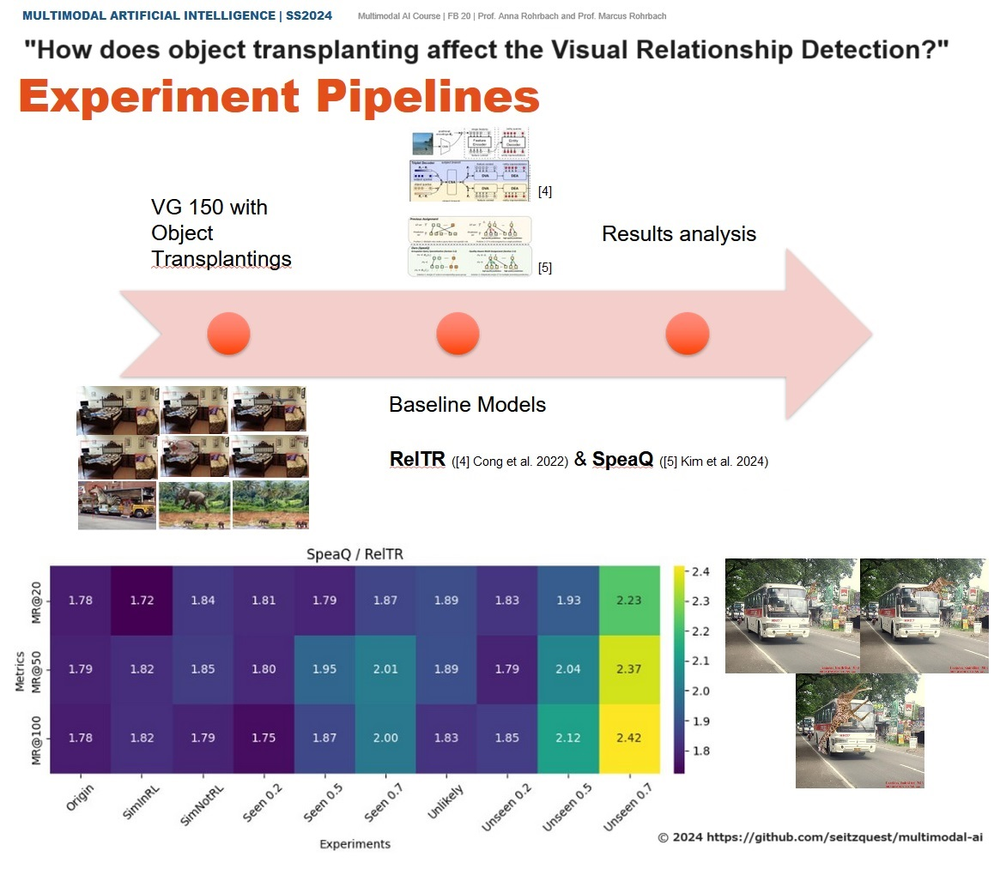
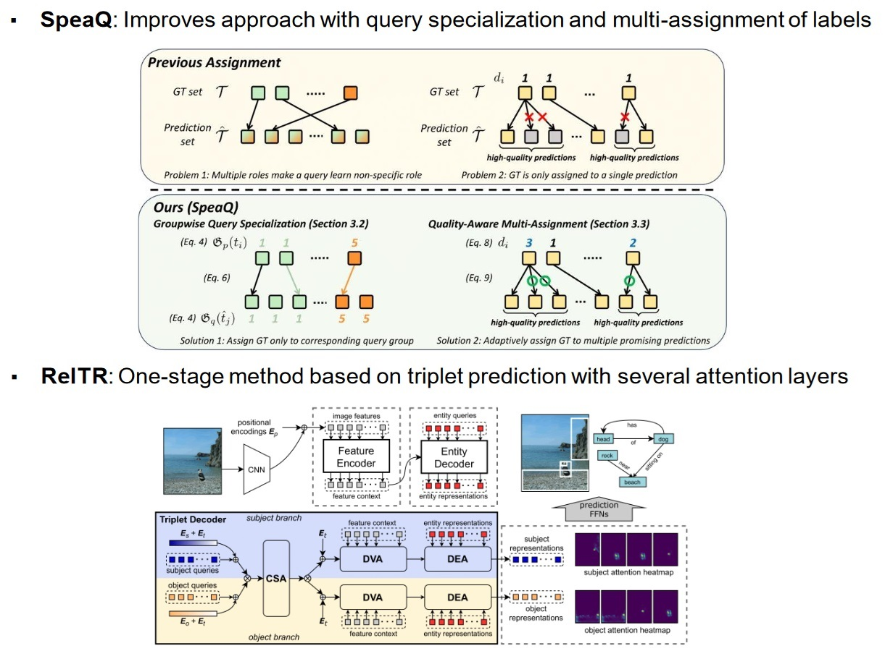

# Evaluating the Robustness of Scene Graph Generation Models With Known and Unknown Objects Transplantation
<strong>[Z Chen](https://github.com/ZiyuanChen-Zoey), [G Le](https://github.com/Gii-DE), [J Martini](https://github.com/japma), [M Sakharova](https://github.com/MarinaJim) and [P Seitz](https://github.com/seitzquest)</strong>

<div align="center">
    <br>
    "<i>Transplanting objects will reduce the performance of the visual relationship detection compared to the unmodified counterpart.</i>"
</div>

## About
This repository contains the code needed for preprocessing the [Visual Genome dataset](https://homes.cs.washington.edu/~ranjay/visualgenome/index.html).

## Introduction
The detection of objects in images and how they are related to each other is a fundamental challenge in reasoning about complex scenes. 
Scene Graph Generation (SGG) refers to the multimodal AI tasks of detecting and classifying the objects in an image and generating a graph-structured representation that captures the object relationships. It is highly relevant for various applications like Image Captioning, Visual Question Answering (VQA) and Autonomous Navigation.

However, as shown by [Rosenfeld et al. (2018)](https://arxiv.org/pdf/1808.03305v1), object detection systems are vulnerable to object transplanting, such that a modification of a subimage has a non-local effect on the detection accuracy of objects even though they are still fully present in the image.

In this project, we examine how transplanting different types of objects, such as seen and unseen objects, impacts the robustness of state-of-the-art SGG models, aiming to validate whether object relationship detection suffers from similar failure modes in the face of object transplantation, and how size, position and type of the transplanting affect the generated graph. 
We hypothesize that transplanting objects will reduce the performance of the visual relationship detection compared to the unmodified counterpart. By analyzing the bounding boxes of the transplanted objects with respect to the scene objects, we additionally analyze how strong the effect is when no areas of the relationship are occluded, assuming spatial locality of the relationships.

## Limitations & Future work
- Evaluation of different architecture models' performance​ (only transformer-based triplet-decoder approaches were used in this study)
- Quantitative evaluation of patch strategies ​(esspecially minimal patch strategy)
- Training for object transplanting robustness

## Requirements
There are some requirements needed to run the code in this repository, using conda is the easiest way.
It also suffices to simply use pip
- Create a new conda environment:
```bash
conda create --name multimodal-ai python=3.10
``` 
Note: The python version is 3.10, but any version of python 3 should work.
- Activate the environment:
```bash
conda activate multimodal-ai
```
- Install the required packages:
```bash
pip install -r requirements.txt
```

## Preprocessing

- Run the following commands to preprocess the dataset:
```bash
cd vg_preprocessing
python main.py
```
There are some parameters that can be passed to the script:
- `--modified_directory`: Path to the directory where the modified dataset will be saved.
- `--overlay_image_path`: Path to the overlay image.
- `--seed`: Seed for the random number generator for reproducibility.
- `--num_images`: Number of images to preprocess.
- `--patch_strategy`: Strategy for finding patch. Can be 'minimal', 'maximal' or 'random'. You can also use 'minimal_heuristic', 'maximal_heuristic' or 'random_heuristic' for the heuristic version.
- `--correlate_overlay`: Overrides the overlay image and patch strategy by using a correlated object
- `--visualize-bb`: Visualize bounding boxes

### Additional Notes
- There is a selection of possible objects that can be inserted in the folder `vg_preprocessing/insert_objects`. Some of these objects have a transparent background, while others are not fully segmented and still have a black background. These have the ending `*_with_bounding_box`.
- You can use the `--overlay_image_path` parameter to specify the path to these images. If you do not specify this parameter, an image of a bug will be used as the transplanted object.
- You can also run the script without any flags, in which case the default values will be used:
   - `--modified_directory`: `VG_100K_subset_modified`
    - `--overlay_image_path`: `vg_preprocessing/insert_objects/maikaefer.png`
    - `--seed`: random seed
    - `--num_images`: 100
    - `--patch_strategy`: 'minimal'
    - `--correlate_overlay`: False
    - `--visualize-bb`: False

## Evaluation
In `baseline_models/` you can find our adapted code for the two evaluated SGG models RelTR and SpeaQ.
Please consult the local `README.md` file for their setup and how to download the VG dataset. Make sure that you also install the packages from `requirements.txt` in their respective conda environments.

Additionally we use SAM for segmentation, which can be downloaded [here](https://huggingface.co/ybelkada/segment-anything/blob/main/checkpoints/sam_vit_h_4b8939.pth)
- For RelTR, put the model into `baseline_models/RelTR/ckpt/sam_vit_h_4b8939.pth` along with the RelTR model checkpoint `checkpoint0149.pth`

<div align="center">
    <br>
</div>

### Setup Tips for RelTR
For RelTR, we encountered a conda error with opencv when trying to add it to the python 3.6 conda environment. As described in [here](https://stackoverflow.com/a/63752514), fixing the version using `pip install opencv-python==3.4.13.47` resolved the issue.

Later on, we decided to use python 3.10 instead of the 3.6 in order to run the code on a modern GPU as it is required for installing pytorch nightly. The only adaptation that was necessary, was installing CoCo using `pip install pycocotools` instead of the CoCo Dataset PythonAPI `pip install -U 'git+https://github.com/cocodataset/cocoapi.git#subdirectory=PythonAPI'`. Using 3.10 also resolved the version issue with opencv described above.

## Credits / Acknowledgements
Our codebase is based on [](https://paperswithcode.com/sota/scene-graph-generation-on-visual-genome?p=groupwise-query-specialization-and-quality) [SpeaQ](https://github.com/mlvlab/SpeaQ), [RelTR](https://github.com/yrcong/RelTR) and [SAM](https://github.com/facebookresearch/segment-anything).
